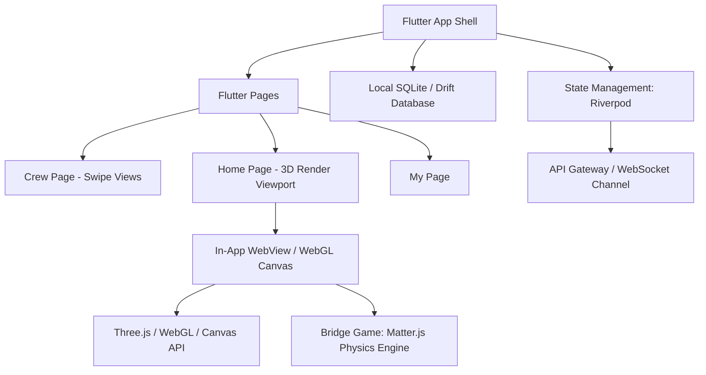

# Architecture Design: Gamified Fitness App (CrewSo)

This document provides a comprehensive technical architecture and design specification for the gamified mobile fitness app, based on the provided Home Island visual design and functional requirements.

---

## 1. Database Schema

Here is the complete schema definition supporting the relational database structure (PostgreSQL) and matching JSON models for real-time synchronization.

### SQL DDL Schema (PostgreSQL)

```sql
-- Enums
CREATE TYPE workout_intensity AS ENUM ('LOW', 'MODERATE', 'HIGH');
CREATE TYPE node_status AS ENUM ('VISITED', 'CURRENT', 'ADJACENT_AVAILABLE', 'LOCKED');
CREATE TYPE material_type AS ENUM ('WOODEN_PLANK', 'TRACK_STONE');
CREATE TYPE session_status AS ENUM ('BUILDING', 'SUCCESS', 'FAILED');

-- Users Table
CREATE TABLE users (
    id UUID PRIMARY KEY DEFAULT gen_random_uuid(),
    nickname VARCHAR(50) NOT NULL UNIQUE,
    profile_image_url TEXT,
    fitness_points INT DEFAULT 0 CHECK (fitness_points >= 0),
    track_stones INT DEFAULT 0 CHECK (track_stones >= 0),
    wooden_planks INT DEFAULT 0 CHECK (wooden_planks >= 0),
    current_island_id VARCHAR(50) NOT NULL,
    created_at TIMESTAMPTZ DEFAULT CURRENT_TIMESTAMP
);

-- Workouts Table (MET based)
CREATE TABLE workouts (
    id UUID PRIMARY KEY DEFAULT gen_random_uuid(),
    user_id UUID NOT NULL REFERENCES users(id) ON DELETE CASCADE,
    workout_type VARCHAR(50) NOT NULL, -- e.g., 'RUNNING', 'CYCLING', 'WALKING'
    intensity workout_intensity NOT NULL,
    duration_minutes INT NOT NULL CHECK (duration_minutes > 0),
    gps_recorded BOOLEAN DEFAULT FALSE,
    gps_route_geojson JSONB, -- Coordinates array or GeoJSON LineString
    met_value NUMERIC(4, 2) NOT NULL, -- Metabolic Equivalent of Task
    fitness_points_earned INT NOT NULL, -- Calculated as MET * Duration * constant
    photo_verification_url TEXT, -- South Node: Photo verification
    workout_date TIMESTAMPTZ DEFAULT CURRENT_TIMESTAMP
);

-- Crews Table
CREATE TABLE crews (
    id UUID PRIMARY KEY DEFAULT gen_random_uuid(),
    name VARCHAR(100) NOT NULL UNIQUE,
    headquarters_level VARCHAR(20) DEFAULT 'TENT', -- TENT, CABIN, BUILDING
    created_at TIMESTAMPTZ DEFAULT CURRENT_TIMESTAMP
);

-- Crew Members (Relational mapping)
CREATE TABLE crew_members (
    crew_id UUID REFERENCES crews(id) ON DELETE CASCADE,
    user_id UUID REFERENCES users(id) ON DELETE CASCADE,
    weekly_step INT DEFAULT 0 CHECK (weekly_step BETWEEN 0 AND 7), -- Roadmap stage
    joined_at TIMESTAMPTZ DEFAULT CURRENT_TIMESTAMP,
    PRIMARY KEY (crew_id, user_id)
);

-- Island Nodes (World Map)
CREATE TABLE island_nodes (
    id VARCHAR(50) PRIMARY KEY,
    name VARCHAR(100) NOT NULL,
    x_coord DOUBLE PRECISION NOT NULL,
    y_coord DOUBLE PRECISION NOT NULL,
    difficulty INT DEFAULT 1
);

-- User-Island Nodes Progress
CREATE TABLE user_island_states (
    user_id UUID REFERENCES users(id) ON DELETE CASCADE,
    island_id VARCHAR(50) REFERENCES island_nodes(id) ON DELETE CASCADE,
    status node_status NOT NULL DEFAULT 'LOCKED',
    updated_at TIMESTAMPTZ DEFAULT CURRENT_TIMESTAMP,
    PRIMARY KEY (user_id, island_id)
);

-- Shared Bridge Building Sessions (Wilson & Robinson Weekend Game)
CREATE TABLE bridge_sessions (
    id UUID PRIMARY KEY DEFAULT gen_random_uuid(),
    crew_id UUID REFERENCES crews(id) ON DELETE CASCADE,
    target_island_id VARCHAR(50) REFERENCES island_nodes(id) ON DELETE CASCADE,
    status session_status DEFAULT 'BUILDING',
    created_at TIMESTAMPTZ DEFAULT CURRENT_TIMESTAMP,
    ended_at TIMESTAMPTZ
);

-- Bridge Materials (Placements submitted by crew members)
CREATE TABLE bridge_materials (
    id UUID PRIMARY KEY DEFAULT gen_random_uuid(),
    session_id UUID REFERENCES bridge_sessions(id) ON DELETE CASCADE,
    user_id UUID REFERENCES users(id) ON DELETE SET NULL,
    material_type material_type NOT NULL,
    x_pos NUMERIC(6, 2) NOT NULL, -- Coordinates inside physics sandbox
    y_pos NUMERIC(6, 2) NOT NULL,
    rotation NUMERIC(5, 2) NOT NULL, -- Rotation angle (radians)
    submitted_at TIMESTAMPTZ DEFAULT CURRENT_TIMESTAMP
);

-- Indexes for Query Optimization
CREATE INDEX idx_workouts_user_id ON workouts(user_id);
CREATE INDEX idx_crew_members_user_id ON crew_members(user_id);
CREATE INDEX idx_user_island_states_user_id ON user_island_states(user_id);
CREATE INDEX idx_bridge_materials_session_id ON bridge_materials(session_id);
```

### JSON Schema (Real-time Synced WebSocket Session Event Payload)

```json
{
  "$schema": "http://json-schema.org/draft-07/schema#",
  "title": "BridgeMaterialPlacementEvent",
  "type": "object",
  "properties": {
    "sessionId": { "type": "string", "format": "uuid" },
    "userId": { "type": "string", "format": "uuid" },
    "material": {
      "type": "object",
      "properties": {
        "materialType": { "type": "string", "enum": ["WOODEN_PLANK", "TRACK_STONE"] },
        "position": {
          "type": "object",
          "properties": {
            "x": { "type": "number" },
            "y": { "type": "number" }
          },
          "required": ["x", "y"]
        },
        "rotation": { "type": "number" }
      },
      "required": ["materialType", "position", "rotation"]
    },
    "remainingAttempts": { "type": "integer", "minimum": 0, "maximum": 2 },
    "timestamp": { "type": "string", "format": "date-time" }
  },
  "required": ["sessionId", "userId", "material", "remainingAttempts", "timestamp"]
}
```

---

## 2. Cross-Platform State Management Models

This section outlines how state is managed inside a **React Native / TypeScript** shell using `Zustand` and a **Flutter** client using `Riverpod`.

### React Native State Management (`Zustand` + TypeScript)

```typescript
import { create } from 'zustand';

// App Navigation & Tabs
export type TabType = 'CREW' | 'HOME' | 'MY_PAGE';
export type CrewSubTabType = 'ROADMAP' | 'GRID';

interface AppNavigationState {
  activeTab: TabType;
  crewSubTab: CrewSubTabType;
  setActiveTab: (tab: TabType) => void;
  setCrewSubTab: (subTab: CrewSubTabType) => void;
}

export const useNavigationStore = create<AppNavigationState>((set) => ({
  activeTab: 'HOME',
  crewSubTab: 'ROADMAP',
  setActiveTab: (tab) => set({ activeTab: tab }),
  setCrewSubTab: (subTab) => set({ crewSubTab: subTab }),
}));

// Home Island Huts & Dialogs State
export type HutType = 'NORTH_SETTINGS' | 'EAST_FRIENDS' | 'SOUTH_HISTORY' | 'WEST_WAREHOUSE' | null;

interface HomeIslandState {
  activeHut: HutType;
  workoutSettings: {
    workoutType: string;
    intensity: 'LOW' | 'MODERATE' | 'HIGH';
    baseTimeMinutes: number;
    gpsRouteRecording: boolean;
  };
  openHut: (hut: HutType) => void;
  closeHut: () => void;
  updateWorkoutSettings: (settings: Partial<HomeIslandState['workoutSettings']>) => void;
}

export const useHomeIslandStore = create<HomeIslandState>((set) => ({
  activeHut: null,
  workoutSettings: {
    workoutType: 'RUNNING',
    intensity: 'MODERATE',
    baseTimeMinutes: 30,
    gpsRouteRecording: false,
  },
  openHut: (hut) => set({ activeHut: hut }),
  closeHut: () => set({ activeHut: null }),
  updateWorkoutSettings: (settings) =>
    set((state) => ({
      workoutSettings: { ...state.workoutSettings, ...settings },
    })),
}));

// Mini-game Shared Bridge Session State
interface BridgeMaterial {
  userId: string;
  materialType: 'WOODEN_PLANK' | 'TRACK_STONE';
  x: number;
  y: number;
  rotation: number;
}

interface BridgeGameStore {
  sessionId: string | null;
  targetIslandId: string | null;
  placedMaterials: BridgeMaterial[];
  userAttempts: number; // Max 2
  isSimulating: boolean;
  startSession: (sessionId: string, targetIslandId: string) => void;
  addMaterial: (material: BridgeMaterial) => void;
  setUserAttempts: (attempts: number) => void;
  setSimulating: (simulating: boolean) => void;
  syncSession: (materials: BridgeMaterial[]) => void;
  resetSession: () => void;
}

export const useBridgeGameStore = create<BridgeGameStore>((set) => ({
  sessionId: null,
  targetIslandId: null,
  placedMaterials: [],
  userAttempts: 0,
  isSimulating: false,
  startSession: (sessionId, targetIslandId) => set({ sessionId, targetIslandId, placedMaterials: [], userAttempts: 0 }),
  addMaterial: (material) => set((state) => ({ placedMaterials: [...state.placedMaterials, material] })),
  setUserAttempts: (attempts) => set({ userAttempts: attempts }),
  setSimulating: (simulating) => set({ isSimulating: simulating }),
  syncSession: (materials) => set({ placedMaterials: materials }),
  resetSession: () => set({ sessionId: null, targetIslandId: null, placedMaterials: [], userAttempts: 0, isSimulating: false }),
}));
```

---

### Flutter State Management (`Riverpod` / Dart)

For Flutter implementations, a cleaner approach uses state notifiers and providers to handle the main navigation state, home screen modals, and bridge simulation states.

```dart
import 'package:flutter_riverpod/flutter_riverpod.dart';

// Tabs Enum
enum AppTab { crew, home, myPage }
enum CrewSubTab { roadmap, grid }
enum ActiveHut { none, northSettings, eastFriends, southHistory, westWarehouse }

// 1. Navigation State
class NavigationState {
  final AppTab activeTab;
  final CrewSubTab crewSubTab;

  NavigationState({required this.activeTab, required this.crewSubTab});

  NavigationState copyWith({AppTab? activeTab, CrewSubTab? crewSubTab}) {
    return NavigationState(
      activeTab: activeTab ?? this.activeTab,
      crewSubTab: crewSubTab ?? this.crewSubTab,
    );
  }
}

class NavigationNotifier extends StateNotifier<NavigationState> {
  NavigationNotifier() : super(NavigationState(activeTab: AppTab.home, crewSubTab: CrewSubTab.roadmap));

  void setActiveTab(AppTab tab) => state = state.copyWith(activeTab: tab);
  void setCrewSubTab(CrewSubTab subTab) => state = state.copyWith(crewSubTab: subTab);
}

final navigationProvider = StateNotifierProvider<NavigationNotifier, NavigationState>((ref) {
  return NavigationNotifier();
});

// 2. Home Island Overlay State (Huts)
class HomeIslandNotifier extends StateNotifier<ActiveHut> {
  HomeIslandNotifier() : super(ActiveHut.none);

  void openHut(ActiveHut hut) => state = hut;
  void closeHut() => state = ActiveHut.none;
}

final homeIslandProvider = StateNotifierProvider<HomeIslandNotifier, ActiveHut>((ref) {
  return HomeIslandNotifier();
});
```

---

## 3. Mock Physics Simulation Loop (Javascript)

This Javascript/TypeScript simulation evaluates whether a character crossing a built bridge will successfully land on the target island or fall. It calculates incremental physical states under acceleration, velocity, character bounding bounds, and colliders.

```javascript
/**
 * Mock 2D rigid-body evaluation loop representing the bridge crossing validity check.
 */

// Constants
const GRAVITY = -9.81; // Pixels or Meters per second squared
const TIME_STEP = 1 / 60; // 60 FPS simulation steps (16.67ms)
const CHARACTER_SPEED_X = 5.0; // Running horizontal velocity

// Types
interface Point2D {
  x: number;
  y: number;
}

interface BoundingBox {
  xMin: number;
  xMax: number;
  yMin: number;
  yMax: number;
}

interface PhysicalMaterial {
  type: 'WOODEN_PLANK' | 'TRACK_STONE';
  x: number;
  y: number;
  width: number;
  height: number;
  rotation: number; // in radians
}

interface SimulationParams {
  startNode: Point2D;
  endNode: Point2D;
  materials: PhysicalMaterial[];
  failThresholdY: number; // If character drops below this Y, they have fallen into the sea
}

/**
 * Checks if a point lies inside a rotated bounding box (Simplification of SAT collision check)
 */
function isPointCollidingWithMaterial(px: number, py: number, mat: PhysicalMaterial): boolean {
  // Translate point to origin relative to material center
  const dx = px - mat.x;
  const dy = py - mat.y;
  
  // Rotate point back to align with axis-aligned material box
  const cosR = Math.cos(-mat.rotation);
  const sinR = Math.sin(-mat.rotation);
  const rx = dx * cosR - dy * sinR;
  const ry = dx * sinR + dy * cosR;

  const halfW = mat.width / 2;
  const halfH = mat.height / 2;

  return (rx >= -halfW && rx <= halfW && ry >= -halfH && ry <= halfH);
}

/**
 * Run Physics Simulation Evaluation
 * Returns true if the character safely crosses from Left Island to Right Island.
 */
export function evaluateBridgeCrossing(params: SimulationParams): { success: boolean; path: Point2D[] } {
  const { startNode, endNode, materials, failThresholdY } = params;
  
  // Initialize character state
  let charX = startNode.x;
  let charY = startNode.y;
  let velX = CHARACTER_SPEED_X;
  let velY = 0;
  
  const pathHistory: Point2D[] = [{ x: charX, y: charY }];
  let hasFailed = false;
  let hasSucceeded = false;
  
  const maxIterations = 2000; // Safeguard infinite loops
  let iterations = 0;

  while (!hasFailed && !hasSucceeded && iterations < maxIterations) {
    iterations++;

    // Apply horizontal motion
    charX += velX * TIME_STEP;
    
    // Apply gravity
    velY += GRAVITY * TIME_STEP;
    charY += velY * TIME_STEP;

    // Bounding collision checks with all placed materials (wooden planks / stones)
    let isOnSolidGround = false;
    let collisionYAdjustment = 0;

    for (const mat of materials) {
      // Check collision at character's feet (charX, charY)
      if (isPointCollidingWithMaterial(charX, charY, mat)) {
        isOnSolidGround = true;
        
        // Find local rotation y coordinate of the top surface
        const dx = charX - mat.x;
        const cosR = Math.cos(-mat.rotation);
        const sinR = Math.sin(-mat.rotation);
        const rx = dx * cosR; // Approximate projection
        
        // Approximate top height relative to global Y coordinates
        // Re-rotate local top constraint back to global coordinates
        const localTopY = mat.height / 2;
        const globalTopY = mat.y + (rx * sinR + localTopY * cosR);

        if (globalTopY > collisionYAdjustment) {
          collisionYAdjustment = globalTopY;
        }
      }
    }

    if (isOnSolidGround) {
      // Snap character position to the top of the bridge deck and nullify downward vertical velocity
      charY = collisionYAdjustment;
      velY = Math.max(0, velY); // Cancel falling velocity, allow jumping/rising values if present
    }

    // Save path coordinate
    pathHistory.push({ x: charX, y: charY });

    // Success condition: Character reaches or exceeds Right Node's X coordinate and is above the failure threshold
    if (charX >= endNode.x) {
      if (charY >= endNode.y - 10) { // Tolerances for landing
        hasSucceeded = true;
      }
    }

    // Failure conditions: Bounding box falls below the cutoff Y limit
    if (charY <= failThresholdY) {
      hasFailed = true;
    }
  }

  return {
    success: hasSucceeded,
    path: pathHistory
  };
}
```

---

## 4. Flutter Integration Architecture

To build this app in **Flutter** (meeting the Korean prompt: "플러터 기반 앱 디자인해줘") while keeping the complex WebGL graphics of the home screen and physics mini-game optimized, we recommend a hybrid architecture:



### Rendering Options for Flutter:
1. **WebGL Canvas inside WebView (Recommended for game complexity)**:
   - Use the `flutter_inappwebview` package.
   - Run a local static HTML/WebGL bundle optimized for mobile browsers, communicating via `JavaScriptHandler` protocols to synchronize state directly into Flutter's `Riverpod` controller.
2. **Native Canvas Drawing**:
   - Use custom painters if you want to transition to a lightweight 2D-only representation.
3. **Flame Engine**:
   - Use the `flame` + `forge2d` Flutter package if you decide to implement a pure Dart 2D physics game.

---

## 5. Mapping the Visual Asset (Home Screen)
Based on the reference screenshot, we've extracted the layout parameters:

* **Floating Low-Poly Island**: Floating circular island with stylized water shaders.
* **North (12 o'clock) - "주 운동" (Main Workouts)**: Small cabin building. Enables parameters for target distance, sport types, and GPS logging.
* **East (3 o'clock) - "친구" (Friends)**: Tents and campsites. Clicking it zooms into a detailed list.
* **South (6 o'clock) - "기록" (Workout Logs)**: Underneath the main firepit. Triggers a ledger of historical MET workout data.
* **West (9 o'clock) - "아이템" (Inventory & Shop)**: Shop stands with pink weights and fitness materials. Stores track stones and wooden planks.
* **Center - "윌슨 & 로빈슨" (Wilson & Robinson)**: Core campfire monument with the current D-Day timer (`D-5`). Touch to enter the Stage Map.
